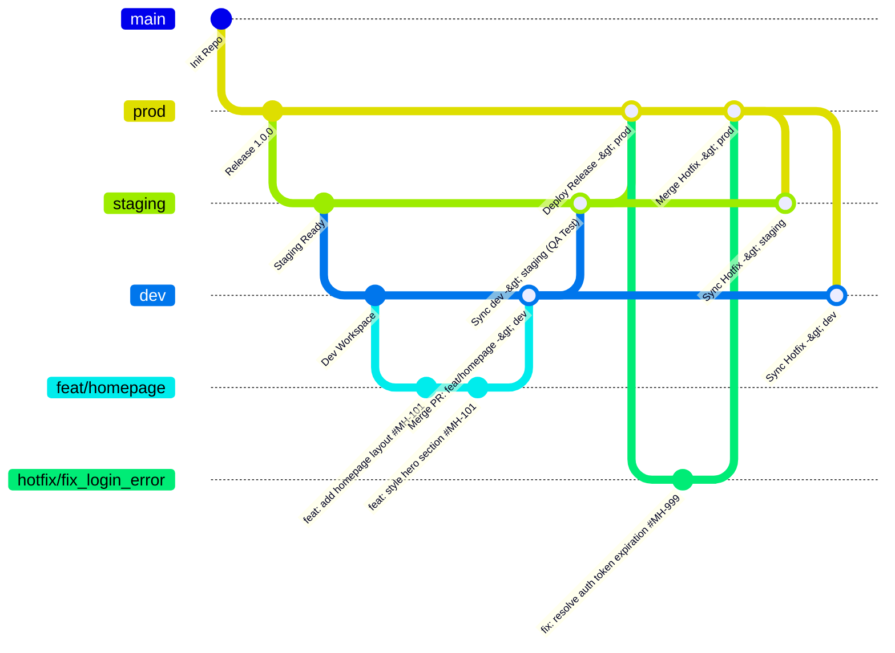
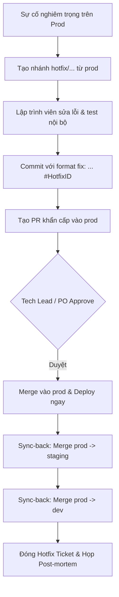

# 🌳 CHIẾN LƯỢC PHÂN PHỐI NHÁNH VÀ QUY TRÌNH GITFLOW
> **Dự án**: Meridian Horizon  
> **Phiên bản chuẩn hóa**: Gitflow Enterprise v1.0  
> **Người soạn thảo / Thẩm định**: Scrum Master & Tech Lead  

---

## 1. Tổng quan kiến trúc phân phối nhánh (Branching Architecture)

Hệ thống quản lý mã nguồn của Meridian Horizon sử dụng mô hình **Gitflow tiêu chuẩn** nhằm đảm bảo:
- Phân tách môi trường rõ ràng (`Development`, `Staging`, `Production`).
- Kiểm soát chất lượng thông qua Code Review và Gateways (DoD).
- Cô lập tính năng đang phát triển, tránh làm gián đoạn mã nguồn đã triển khai.
- Khả năng phản ứng nhanh với sự cố khẩn cấp trên Production thông qua quy trình Hotfix.



---

## 2. Các nhánh chính (Primary Branches)

Hệ sinh thái nhánh của dự án bao gồm **3 nhánh chính vĩnh viễn** đại diện cho 3 môi trường thực thi:

| Nhánh | Môi trường mục tiêu | Quyền Push trực tiếp | Nguồn Merge | Mục đích |
| :--- | :--- | :---: | :--- | :--- |
| **`prod`** | **Production (Live)** | ⛔ **BỊ CHẶN** (Chỉ qua PR) | `staging` (hoặc `hotfix/*`) | Chứa mã nguồn thực thi chính thức cho người dùng cuối. Đảm bảo độ tin cậy và ổn định cao nhất (99.99%). |
| **`staging`** | **Staging / UAT** | ⛔ **BỊ CHẶN** (Chỉ qua PR) | `dev`, `prod` (sau hotfix) | Môi trường thử nghiệm tương đương Production. Dành cho QA kiểm thử hồi quy (Regression Test) và Product Owner demo nghiệm thu. |
| **`dev`** | **Development** | ⚠️ Hạn chế (Khuyến khích PR) | `feat/*`, `bugfix/*`, `prod` | Nhánh tích hợp mã nguồn chung của toàn bộ Tech Team. Nơi các tính năng mới được tổng hợp trước khi đẩy lên Staging. |

---

## 3. Các nhánh tạm thời (Supporting / Temporary Branches)

### 3.1. Nhánh tính năng: `feat/<feature_name>`
- **Nguồn phân nhánh (Source)**: Tạo từ nhánh `dev`.
- **Đích merge (Target)**: `dev` (qua Pull Request / Code Review).
- **Quy tắc đặt tên**: `feat/<kebab-case-or-snake-case>` (VD: `feat/homepage`, `feat/login_page`, `feat/payment-stripe`).
- **Vòng đời**: Bị xóa ngay sau khi PR được merge vào `dev`.

### 3.2. Nhánh sửa lỗi khẩn cấp: `hotfix/<hotfix_name>`
- **Nguồn phân nhánh (Source)**: Tạo trực tiếp từ nhánh `prod`.
- **Đích merge (Target)**:
  1. `prod` (thông qua Emergency PR có phê duyệt).
  2. `staging` (đồng bộ ngược).
  3. `dev` (đồng bộ ngược để không bị mất code vá lỗi ở các sprint sau).
- **Quy tắc đặt tên**: `hotfix/<hotfix_name>` (VD: `hotfix/fix_login_error`, `hotfix/resolve_cors_prod`).
- **Vòng đời**: Bị xóa sau khi đã merge và sync hoàn tất vào cả 3 nhánh.

---

## 4. Chuẩn mực Commit Message (Conventional Commits + Issue ID)

Mỗi commit **BẮT BUỘC** phải tuân thủ chuẩn cấu trúc quốc tế và luôn kèm **Issue ID** để Scrum Master, PO và QA có thể truy vết nguồn gốc (Traceability) trên Jira / GitHub Issues / Trello.

### 4.1. Cấu trúc chuẩn
```text
<type>(<scope>): <mô tả ngắn gọn bằng thể mệnh lệnh> #<issue_id>

[Phần thân - Body: giải thích lý do, chi tiết thay đổi (tùy chọn)]

[Phần chân - Footer: BREAKING CHANGE, Closes #<issue_id> (tùy chọn)]
```

### 4.2. Danh sách các `<type>` hợp lệ

| Loại (`type`) | Ý nghĩa | Ví dụ thực tế |
| :--- | :--- | :--- |
| **`feat`** | Thêm mới tính năng hoàn chỉnh | `feat: Thêm mới tính năng A #MH-101`<br>`feat(auth): Thêm mới tính năng đăng nhập Google #MH-102` |
| **`fix`** | Sửa lỗi mã nguồn | `fix: Sửa lỗi tính năng D #MH-203`<br>`fix(cart): sửa lỗi tính sai tổng tiền giảm giá #MH-204` |
| **`refactor`** | Tối ưu/tái cấu trúc code (không đổi logic bên ngoài) | `refactor(login): sửa logic xử lý ký tự đầu vào #MH-150` |
| **`vendor` / `chore`**| Cập nhật thư viện, Docker, cấu hình build phụ trợ | `vendor(docker-compose): Cập nhật phiên bản mới Redis thành latest #MH-300`<br>`chore(deps): nâng cấp axios lên v1.6.0 #MH-301` |
| **`docs`** | Viết hoặc cập nhật tài liệu | `docs(gitflow): bổ sung sơ đồ quy trình phân nhánh #MH-050` |
| **`test`** | Thêm hoặc sửa các bài kiểm thử tự động | `test(order): bổ sung unit test cho thanh toán VNPay #MH-180` |
| **`perf`** | Cải thiện hiệu năng xử lý | `perf(query): tối ưu chỉ mục bảng transactions #MH-290` |

> 💡 **Cảnh báo lỗi Commit "Rởm"**:
> - ❌ *Sai*: `feat(logout): Fix bug ở chỗ tính năng đăng xuất` ➔ Sửa bug nhưng lại dùng tiền tố `feat`.
> - ✅ *Đúng*: `fix(logout): Khắc phục lỗi token không bị hủy khi đăng xuất #MH-211`

---

## 5. Quy trình làm việc chi tiết (Standard Workflow SOP)

### Bước 1: Khởi tạo nhánh tính năng
```bash
# Đảm bảo dev đang cập nhật mới nhất
git checkout dev
git pull origin dev

# Tạo nhánh tính năng mới
git checkout -b feat/homepage
```

### Bước 2: Viết code và Commit chuẩn
```bash
git add .
git commit -m "feat(homepage): add hero section and responsive layout #MH-101"
git push -u origin feat/homepage
```

### Bước 3: Tạo Pull Request vào `dev`
- Tạo PR trên GitHub/GitLab: `base: dev` ⬅️ `compare: feat/homepage`.
- Gắn Issue ID `#MH-101`.
- Tối thiểu 1 Tech Lead / Peer Reviewer approve.
- CI pipeline chạy pass (build, test, lint).
- Merge PR (khuyến nghị dùng **Squash & Merge** hoặc **Rebase & Merge** để giữ lịch sử sạch).

### Bước 4: Chuyển giao sang `staging` để QA & Demo Sprint
- Khi các feature trong Sprint đã sẵn sàng kiểm thử:
```bash
git checkout staging
git pull origin staging
git merge dev --no-ff -m "chore(release): promote dev to staging for QA sprint testing #MH-REL-01"
git push origin staging
```

### Bước 5: Triển khai Production (`prod`)
- Sau khi QA Sign-off và Product Owner chấp thuận tại Sprint Review:
```bash
git checkout prod
git pull origin prod
git merge staging --no-ff -m "chore(release): release version 1.0.0 to production #MH-REL-01"
git push origin prod
git tag -a v1.0.0 -m "Release v1.0.0 official"
git push origin v1.0.0
```

---

## 6. Quy trình xử lý lỗi khẩn cấp (Hotfix Escalation Workflow)

Khi phát sinh sự cố nghiêm trọng trên môi trường Production (Severity 1 / P0 blocker):



### Lệnh thực thi Hotfix chuẩn:
```bash
# 1. Tạo nhánh hotfix từ prod
git checkout prod
git pull origin prod
git checkout -b hotfix/fix_login_error

# 2. Sửa lỗi, kiểm tra cục bộ và commit
git add .
git commit -m "fix(auth): resolve critical null pointer exception on login #HOTFIX-911"
git push -u origin hotfix/fix_login_error

# 3. Sau khi PR vào prod được phê duyệt, merge vào prod
git checkout prod
git merge hotfix/fix_login_error --no-ff -m "merge: hotfix/fix_login_error into prod"
git push origin prod

# 4. BẮT BUỘC: Đồng bộ ngược vào staging và dev (Sync-back)
git checkout staging
git pull origin staging
git merge prod -m "sync: back-merge hotfix from prod to staging"
git push origin staging

git checkout dev
git pull origin dev
git merge prod -m "sync: back-merge hotfix from prod to dev"
git push origin dev

# 5. Dọn dẹp nhánh hotfix
git branch -d hotfix/fix_login_error
git push origin --delete hotfix/fix_login_error
```
